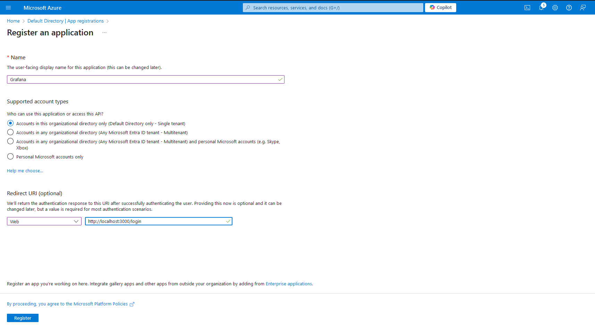
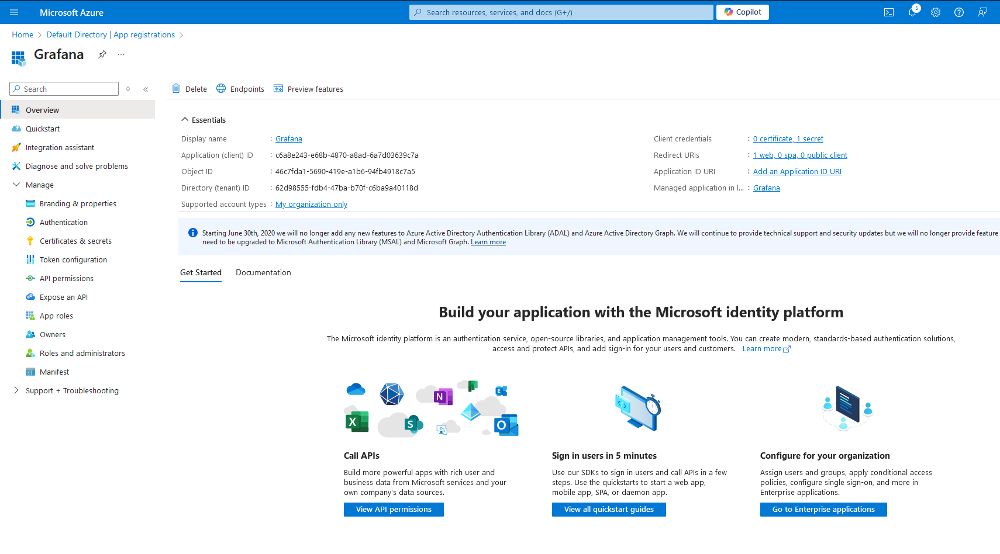
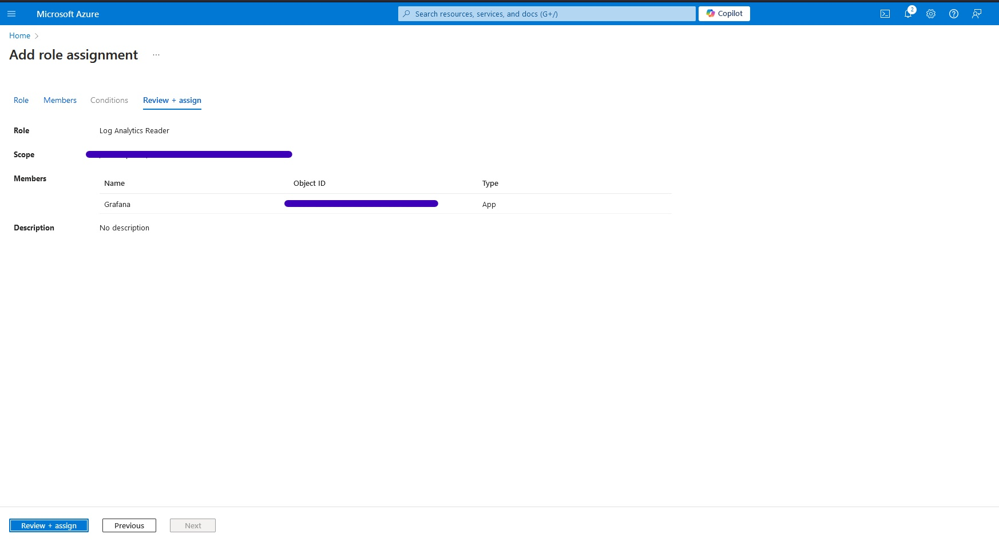

## Grafana Configuration with Azure Monitor

### Pre-requisites:

- Open Source (Self-managed) / Grafana Cloud (Fully-managed)
- Azure Account with an Active Subscription

### Configuration:

1. Configuring the Data Sources -

- Since, we're working with Azure Monitor, we'll be configuring the Azure Monitor Data source

- Azure Monitor data source supports visualizing data from 4 Azure Services

  - Azure Monitor Metrics
  - Azure Monitor Logs
  - Azure Monitor Graph
  - Azure Monitor Application Insights


1. Log-in to the Grafana cloud, using the url `http://localhost:3000/login` and the default username/password is `admin/admin`

2. So, once we're able to login the grafana cloud, first thing we need to do is adding a data source which in our case is Azure Monitor 

* From the left pane, Connections > Data sources > Add new data source 


* Next, search for Azure Monitor and select it 

* Now we need to add the Directory (tenant) ID, Application (client) Id & Client Secret 


1. Visit Azure portal where all our resources are present and open a Cloud Shell
* From powershell cli find out the Subscription ID and the Tenant Id
```
Get-AzureRmContext | Select Subscription, Tenant
```
* Hence, we received the Tenant ID so key this Tenant ID in Grafana portal

1. After this, we need to add the Security principle like users have user principle same way security has security principle

* So, Grafana is going to use this security principle to access the API

* For this, we need to visit Azure portal and search for Microsoft Entra ID i.e., Azure Active Directory

* In the left pane, we have Manage > App Registrations > New Registration 



* From here, we received the Application (client) ID



1. Now, we're left with client secret. But before that, we need to give permission to the newly created `Grafana App` to access Azure Monitor

2. Next, Open the Grafana App from Microsoft Entra Id > App Registrations > View all application in the directory
* From here select our recently created application i.e., Grafana
* From the Left Pane, Manage > API permissions > Add a permission

* Here search for Azure Monitor Control Service


* Don't forget to "Grant admin consent for Default Directory"

7. Now the API has permission and we Azure Monitor Control Service as a user, need to provide a role to actually be able to read the Azure Monitor

8. For this, we need to provide a role at the subscription level
* In the Azure Portal, navigate to Subscriptions > Add > Add role assignment > Job function roles 




9. Finally, we need a client secret.

* Again in the Azure Portal, navigate to Microsoft Entra Id > App 
* From the left pane, Manage > Certificates & secrets > New client secret

* Enter the description of your choice and also expiry of the secret key then add it
* Here we've got secret Value and Secret ID


* Finally, after entering all the required details, Save & test


* Now, we're ready to use Grafana and get all details of the required resources from Azure Monitor

### References ~

_**[Set up Grafana](https://grafana.com/docs/grafana/latest/setup-grafana/){:target="\_blank"}**_

_**[Download Grafana](https://grafana.com/grafana/download){:target="\_blank"}**_

_**[Create your free account on Grafana Cloud](https://grafana.com/auth/sign-up/create-user){:target="\_blank"}**_


_**[Get started with Grafana Cloud](https://grafana.com/docs/grafana-cloud/get-started/){:target="\_blank"}**_

_**[Grafana Labs Community](https://grafana.com/community/){:target="\_blank"}**_
